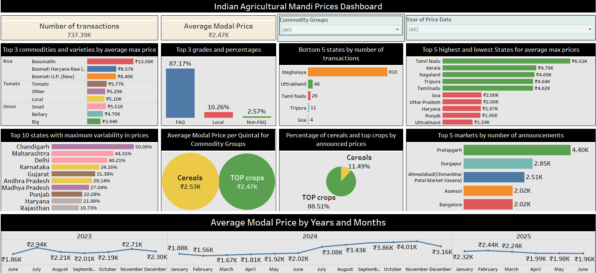

Agricultural Commodities Mandi Prices Dashboard

📊 A Tableau project analyzing mandi prices of key agricultural commodities across India.
This project demonstrates my skills in data cleaning, grouping, visualization, and interactive dashboard design while generating actionable insights for agriculture markets.

🔹 Project Overview

Agricultural mandi prices in India fluctuate across commodities, states, and markets. This dashboard provides a comprehensive view of trends, variability, and comparisons by grouping major commodities into logical categories:

Cereals → Rice, Wheat

TOP Crops → Tomato, Onion, Potato

The dashboard allows stakeholders (farmers, traders, policymakers) to monitor price trends, variability, and state/market-level performance to support data-driven decisions.

🔹 Key Features & Insights

Number of Transactions Analyzed: ~737K

Average Modal Price: ₹2.47K/quintal

Top Commodities: Basumathi Rice (₹13.5K) leads by max price

Grades Distribution: FAQ category dominates with 87% share

State-Level Insights:

Highest prices: Tamil Nadu, Kerala, Nagaland

Lowest prices: Goa, Uttar Pradesh, Punjab

Highest variability: Chandigarh (59%)

Market-Level Insights:

Pratapgarh tops with 4.4K announcements

Meghalaya & Uttarakhand at the bottom with minimal transactions

Price Trends (2023–2025): Seasonal peaks in 2024 (>₹4K), slight stabilization in 2025

🔹 Skills Demonstrated

Data Preparation & Cleaning: Grouped commodities, managed missing values, formatted measures

Dashboard Design in Tableau: Structured layout with KPIs, bar charts, pie charts, and trend lines

Interactive Features: Parameters, filters, and drill-downs by commodity group and year

Storytelling with Data: Combined macro (state-level) and micro (market-level) perspectives into one dashboard

Business Intelligence Application: Insights relevant to agriculture supply chains and policymaking

🔹 Tools & Technologies

Tableau: Data visualization & dashboard development

Excel/CSV: Raw data source for mandi prices

GitHub: Version control and project documentation

🔹 How to Use

Open the Tableau dashboard (.twbx file if included) in Tableau Desktop or Tableau Public.

Use the commodity group and year filters to explore different views.

Analyze KPIs, state comparisons, and price trends over time.

🔹 Project Value

✅ Demonstrates end-to-end dashboard creation skills in Tableau
✅ Showcases ability to turn raw datasets into business-ready insights
✅ Highlights expertise in data visualization, grouping, and trend analysis
✅ Relevant for roles in Business Intelligence, Data Analytics, and Visualization

🔹 Sample Dashboard

